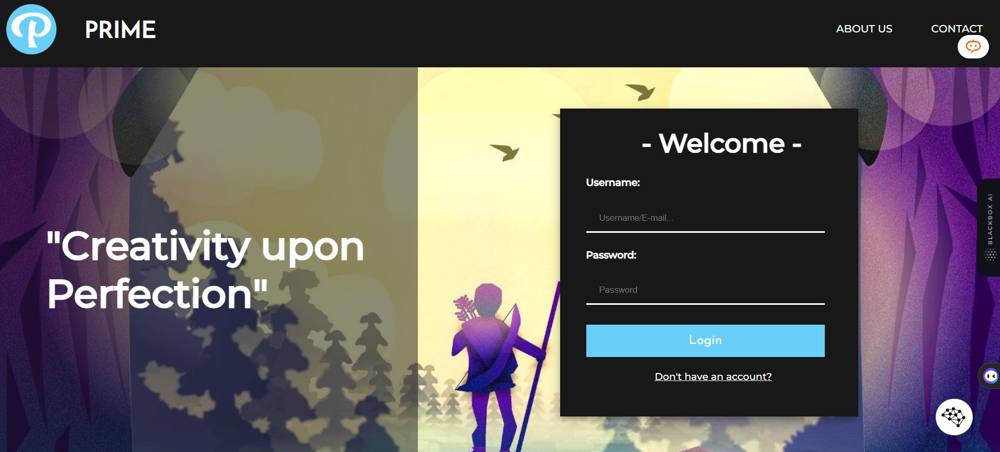

# Prime, a Forum-Website

Hi there! 😁 I created this forum-website called Prime a while back during my fourth semester of college. I wanted to create a space where people could come together to discuss their interests, share ideas, and learn from each other.

In Prime, users can sign up and log in, and then create forums or upload images to share with others. Forums are a great way to have conversations about specific topics, and images can be used to illustrate points or simply to share something beautiful.

Once a forum or image is created, other users can comment on it and like it. This helps to foster discussion and engagement, and it also helps to promote the best content.

I'm still working on Prime, and I'm always looking for ways to improve it. If you have any feedback or suggestions, please don't hesitate to let me know.

Here are some of the features of Prime:

* User-friendly interface: Prime is easy to use, even for first-time forum users.
* Variety of topics: There are forums for a wide variety of topics, so you're sure to find something that interests you.
* Image uploading: You can upload images to your forums or to your profile, which is a great way to illustrate your points or share something beautiful.
* Commenting and liking: Other users can comment on your forums and images, and they can also like your content. This helps to foster discussion and engagement, and it also helps to promote the best content.

I hope you enjoy using Prime! 😁😁

